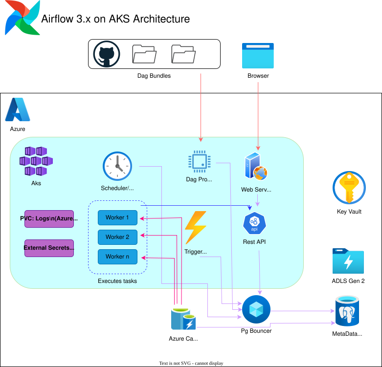

# Architecture

This page describes the architecture of the Airflow on Azure Kubernetes Service (AKS) deployment, including all major components and their roles.

## Architecture Diagram

## Components Explained

- **Azure Kubernetes Service (AKS):** Hosts the Airflow deployment, providing scalable compute resources.
- **Apache Airflow:** The workflow orchestration platform, deployed via Helm on AKS.
- **Azure Key Vault:** Securely stores secrets and credentials used by Airflow and other services.
- **Azure Container Registry (ACR):** Stores Docker images for Airflow and related components.
- **Azure Flexible Server for PostgreSQL:** Provides the metadata database for Airflow.
- **Azure Redis Cache:** Used as the Celery broker for Airflow task queues.
- **Azure Data Lake Storage Gen2:** Used for logs and data (flat file) storage.
- **Azure Workload Identity:** Enables secure, managed identity-based access to Azure resources from pods.
- **Github:** Used to store and version Airflow DagBundles

---

See the [Authentication](Auth.md) section next for a detailed overview of how RBAC is handled.